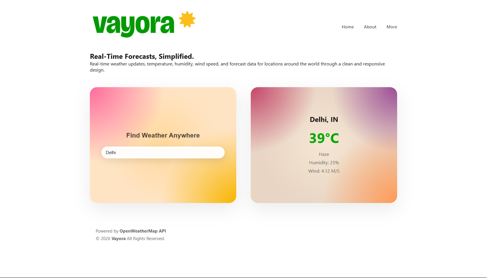

# vayora ☀️

> your fav weather buddy — real-time forecasts, simplified.

Live site → **[coming soon]**

---

## what is this

Vayora is a weather web app that lets you search any city in the world and instantly see live weather conditions — temperature, humidity, wind speed. Built with a clean, minimal UI and a warm gradient design.

This is a personal project I built to learn frontend development and API integration from scratch.

---

## features

- 🌍 Search any city worldwide
- 🌡️ Real-time temperature, humidity, wind speed
- 📅 5-day weather forecast
- 🎨 Dynamic UI that changes based on weather condition
- 📱 Fully responsive — works on mobile, tablet, and desktop
- ⚡ Fast and lightweight — no heavy frameworks

> more features being added as I build — check back soon

---

## built with

- HTML5, CSS3, JavaScript (Vanilla)
- [OpenWeatherMap API](https://openweathermap.org/api) — live weather data
- [Vercel](https://vercel.com/) — deployment

---

## project structure

```
Vayora/
├── public/
│   └── index.html          # main page served to users
├── src/
│   ├── js/
│   │   ├── weather-api.js  # API calls and data handling
│   │   └── app.js          # main app logic
│   ├── css/
│   │   └── style.css       # all styling
│   └── assets/
│       ├── icons/          # app icons
│       └── images/         # illustrations and images
├── README.md
└── LICENSE
```

---

## getting started

want to run this locally?

```bash
# 1. clone the repo
git clone https://github.com/wakkawakka3/vayora.git

# 2. open the folder
cd vayora

# 3. get a free API key from openweathermap.org

# 4. add your key to src/js/weather-api.js where it says YOUR_API_KEY

# 5. open public/index.html in your browser — done
```

no installs. no build tools. just open and run.

---

## screenshots



---

## license

This project is licensed under the MIT License — see the [LICENSE](LICENSE) file for details.

---

## author

**Akansh Rawat**
[LinkedIn](https://www.linkedin.com/in/akansh-rawat/) · [GitHub](https://github.com/wakkawakka3) · [Portfolio](https://wakkawakka3.github.io/akansh-portfolio/)